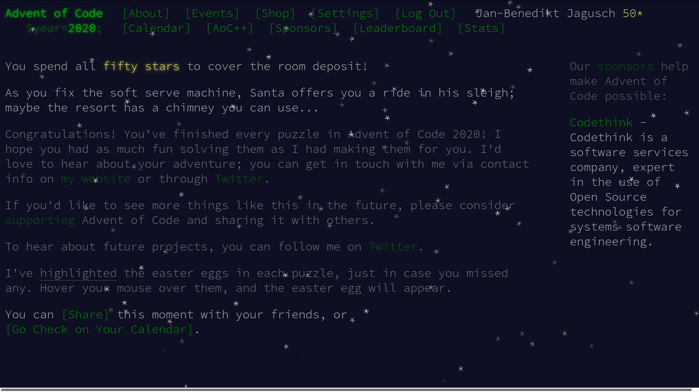

# Advent of Code 2020

Solutions for [Advent of Code 2020](https://adventofcode.com/2020). I used Python and limited myself to the standard library (with [one exception](./day_20), where it used `numpy` for convenience).

Things that I have learned/got better at:

* Designing recursive search algorithms ([16](./day_16), [20](./day_20), [21](./day_21), [22](./day_22))
* Playing [Conway's Game of Life](https://en.wikipedia.org/wiki/Conway%27s_Game_of_Life) ([11](./day_11), [17](./day_17), [24](./day_24))
* Applying the [Chinese Remainder Theorem](https://en.wikipedia.org/wiki/Chinese_remainder_theorem) ([13](./day_13))
* Working with binary operations ([14](./day_14))
* Implementing a linked list ([23](./day_23))
* Working with Python's special methods ([12](./day_12), [17](./day_17) and more ...)
* Working with `deque` ([22](./day_22))
* Reading really whacky file formats ([18](./day_18), [19](./day_19) and more ...)
* Building generators and working with the `itertools` library ([17](./day_17) and many more ...)

Thanks to [Eric Wastl](https://github.com/topaz) for making these Christmassy puzzles! 🎅

